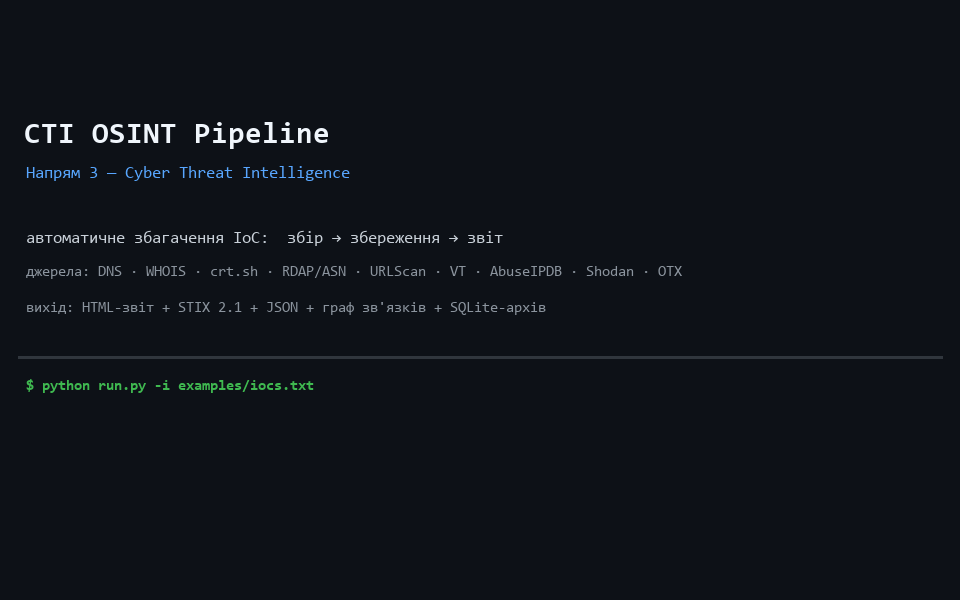

# CTI OSINT Pipeline — автоматизоване збагачення індикаторів компрометації

> Курсовий проєкт «AI для OSINT і розвідки» · **Напрям 3 — Cyber Threat Intelligence**

## Демонстрація



_Один запуск `python run.py -i examples/iocs.txt`: збір з реальних джерел → архівація →
автоматичний звіт (HTML + STIX 2.1 + JSON + граф)._

## 1. Опис

Автоматизований пайплайн, що приймає на вхід індикатори компрометації (IoC) і виконує
повний цикл **збір → збереження → аналіз і звіт** без ручного втручання. На виході —
HTML-звіт із оцінкою загрози, інтерактивний граф зв'язків, машиночитані артефакти
(**STIX 2.1** + JSON) та повний архів доказів для відтворення.

Запускається **навіть без жодного API-ключа** (працюють безключові джерела: DNS, WHOIS,
crt.sh, RDAP/ASN, URLScan). Платні джерела (VirusTotal, AbuseIPDB, Shodan, OTX)
підключаються автоматично за наявності ключа в `.env`, інакше пропускаються з `WARNING`.

## 2. Напрям і яку задачу вирішує

**Напрям 3 (CTI).** Реальна задача: аналітик SOC або команда реагування виявили
підозрілий IP / домен / URL / хеш файлу і мають швидко вирішити — **блокувати чи
ескалувати**. Пайплайн автоматично збагачує кожен IoC, рахує рівень загрози
(critical / high / medium / low), мапить на MITRE ATT&CK, дає рекомендації щодо
реагування та віддає індикатори у форматі STIX 2.1 для імпорту в TIP/SIEM.

## 3. Як встановити

```bash
python -m venv .venv && . .venv/Scripts/activate   # Windows PowerShell: .venv\Scripts\Activate.ps1
pip install -r requirements.txt
copy .env.example .env        # (опційно) впишіть API-ключі — секрети лише в .env
```
Потрібен Python 3.11+. Усі ключі читаються з оточення / `.env`, хардкоду секретів немає.

## 4. Як запустити

```bash
# зі списку у файлі
python run.py -i examples/iocs.txt

# або напряму, кілька IoC різних типів
python run.py 8.8.8.8 example.com http://testphp.vulnweb.com/ 44d88612fea8a8f36de82e1278abb02f
```
Усі артефакти складаються у `output/YYYY-MM-DD_HH-MM-SS/` + однойменний `.zip`.

**Docker (бонус):**
```bash
docker build -t cti-pipeline .
docker run --rm -v "${PWD}/output:/app/output" --env-file .env cti-pipeline -i examples/iocs.txt
```

## 5. Приклад вхідних даних

`examples/iocs.txt` — один IoC на рядок (рядки з `#` ігноруються):
```
8.8.8.8
example.com
http://testphp.vulnweb.com/
44d88612fea8a8f36de82e1278abb02f
185.220.101.44
```
Типи визначаються автоматично: IPv4, домен, URL, MD5/SHA256, email.

## 6. Приклад вихідного звіту

Кожен запуск створює:
```
output/2026-06-22_15-06-33/
├── report.html         # головний звіт: рівень загрози, MITRE, рекомендації, джерела
├── graph.html          # інтерактивний граф зв'язків (pyvis)
├── graph.json          # вузли/ребра графа
├── stix_bundle.json    # STIX 2.1 bundle (для TIP/SIEM)
├── iocs.json           # плоский machine-readable список збагачених IoC
├── evidence.sqlite     # доказова БД (таблиці iocs / sources / edges)
├── raw/<ioc>/<source>.json   # сирі відповіді кожного джерела (Evidence preservation)
└── run.log             # лог виконання (INFO / WARNING / ERROR)
output/2026-06-22_15-06-33.zip # архів усього вище
```
Приклад `iocs.json`:
```json
{ "indicator": "185.220.101.44", "type": "ipv4", "threat_level": "high",
  "score": 62, "confidence": "high",
  "mitre_attack": [{"id": "T1190", "name": "Exploit Public-Facing Application"}],
  "recommendations": ["BLOCK at perimeter (firewall / proxy / EDR).", "Escalate to incident response."] }
```
Готові приклади артефактів — у папці [`examples/`](examples/).

## 7. Список використаних джерел і API

| Джерело | Ключ | Що дає |
|---|---|---|
| DNS (dnspython) | ні | A/AAAA/MX/NS/TXT, reverse PTR |
| WHOIS (python-whois) | ні | реєстратор, дати, name servers |
| crt.sh | ні | сертифікати Certificate Transparency, субдомени |
| RDAP (rdap.org) | ні | мережа/реєстратор/країна для IP та домену |
| Team Cymru (DNS) | ні | **встановлення IP цілі**: ASN + власник мережі + детектор CDN |
| URLScan.io | ні (пошук) | спостережені сторінки, IP, сервери |
| VirusTotal v3 | так | вердикти антивірусних рушіїв, репутація |
| AbuseIPDB | так | репутаційний скоринг IP, звіти |
| Shodan | так | відкриті порти, CVE, банери |
| AlienVault OTX | так | threat pulses, теги кампаній |

## 8. Відомі обмеження

- Без API-ключів скоринг спирається лише на безключові сигнали — рівень загрози для
  справді шкідливих IoC може бути занижений (демонструється напис «re-run with API keys»).
- `crt.sh` періодично віддає HTTP 5xx — обробляється як `WARNING`, пайплайн не падає.
- WHOIS port 43 може бути заблокований у деяких мережах/контейнерах — джерело
  деградує без зупинки пайплайна.
- Використовується **активний** DNS (резолвинг у реальному часі); справжній *пасивний*
  DNS (історичні записи) потребує платного провайдера (SecurityTrails / Farsight) —
  частково компенсується даними crt.sh та URLScan.
- **Встановлення IP цілі** дає публічно-резолвний IP + ASN. Якщо ціль за реверс-проксі
  CDN (Cloudflare/Fastly/Akamai…), це позначається у звіті як «origin прихований» —
  розкриття справжнього origin-сервера потребує окремих технік (півот по SAN-сертифікатах,
  історичний DNS, Shodan favicon/cert-hash) і не входить у поточний обсяг.
- PDF-експорт опційний (потребує `weasyprint` з нативними залежностями); основний
  формат звіту — HTML. STIX/JSON-маппінг покриває базові типи об'єктів, не весь STIX 2.1.
- Атрибуція та фінальне рішення — за аналітиком; інструмент лише пропонує (AI/автоматика
  не несе відповідальності за висновок).

---
**Критерії рубрики:** 3 етапи (збір→збереження→звіт) ✓ · реальна задача ✓ · `.env` для ключів ✓
· timestamped-архів ✓ · лог INFO/WARNING/ERROR ✓ · авто-звіт ✓ · бонус: граф + інтерактив + Docker ✓
